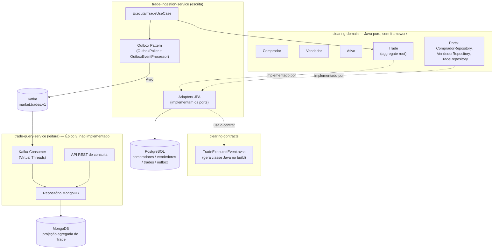
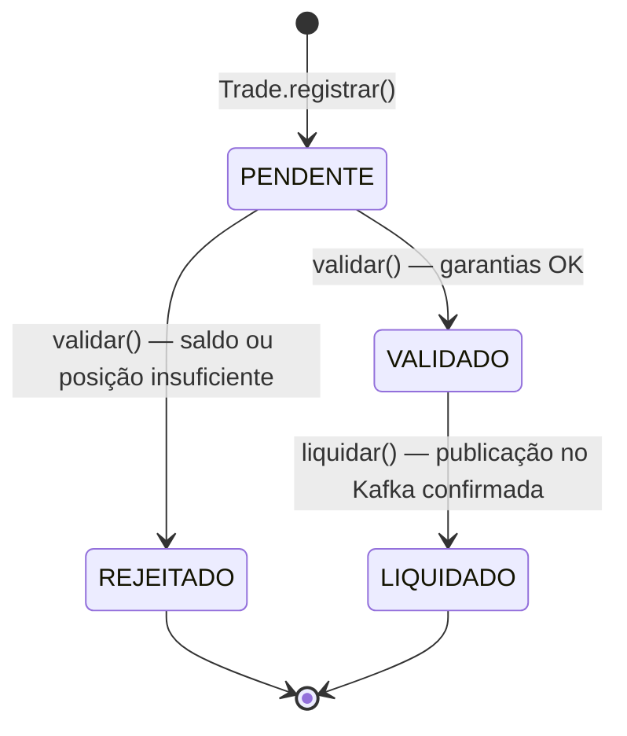
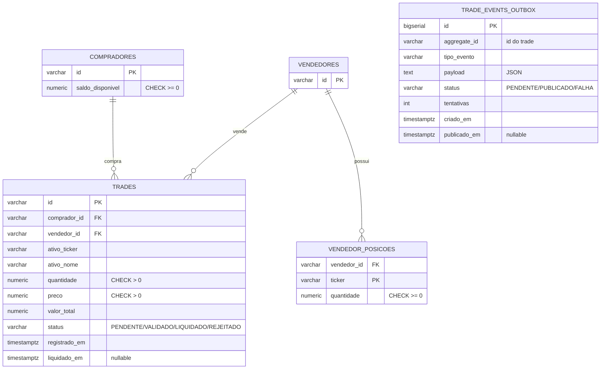

<h3 align="center">Clearing Modernization</h3>
<p align="center">Modernização de um fluxo de Clearing de produtos financeiros com Arquitetura Orientada a Eventos (EDA) e CQRS</p>

<p align="center">
  <a href="https://github.com/erichiroshi/clearing-modernization/actions/workflows/ci.yml"></a>
  <a href="https://sonarcloud.io/summary/new_code?id=erichiroshi_clearing-modernization"></a>
</p>

<p align="center">
  
  
  
  
  
  
  
  
  
  <a href="https://github.com/erichiroshi/clearing-modernization/releases/tag/v0.2.0"></a>

</p>

> ⚠️ **Projeto em andamento.** Este README é atualizado a cada task entregue — veja a seção [Status do Projeto / Roadmap](#-status-do-projeto--roadmap) para o que já existe de verdade vs. o que ainda está planejado. Para o histórico completo de decisões e trade-offs de cada task, veja a pasta [`about/`](about/).

---

## 🧭 Visão Geral

Sistemas tradicionais de Clearing (compensação e liquidação) processam operações em lote ou via chamadas síncronas pesadas sobre bancos relacionais monolíticos — um modelo que não escala para o volume de negociação moderno: gera gargalos de concorrência, indisponibilidade e latência inaceitável.

Este projeto reestrutura esse fluxo usando **Arquitetura Orientada a Eventos (EDA)** com **CQRS** (separação entre escrita e leitura): um serviço de **Ingestão** valida e debita garantias de forma isolada e transacional, enquanto um serviço de **Consulta** entrega a posição consolidada instantaneamente a partir de uma projeção assíncrona — permitindo que a clearing atue em tempo real, com baixa latência e alta disponibilidade.

> 📌 **Propósito do projeto**: portfólio técnico para demonstrar, na prática, como uma câmara de compensação funciona — registro de intenção, validação de garantias (**Delivery versus Payment**), liquidação — e como isso se traduz em Domain-Driven Design, EDA/CQRS, Java 25 (Virtual Threads) e Spring Boot 4.

---

## 📚 Sumário

- [🧭 Visão Geral](#-visão-geral)
- [📊 Status do Projeto / Roadmap](#-status-do-projeto--roadmap)
- [🛠️ Stack Tecnológica](#️-stack-tecnológica)
- [🏗️ Arquitetura](#️-arquitetura)
    - [Módulos do monorepo](#módulos-do-monorepo)
    - [Fluxo de escrita — Ingestão de um trade](#fluxo-de-escrita--ingestão-de-um-trade)
    - [Ciclo de vida do Trade](#ciclo-de-vida-do-trade)
- [🗄️ Modelagem da Base de Dados](#️-modelagem-da-base-de-dados)
- [⚙️ Pré-requisitos](#️-pré-requisitos)
- [🚀 Quick Start](#-quick-start)
- [🔧 Variáveis de Ambiente](#-variáveis-de-ambiente)
- [💬 Interagindo com o sistema](#-interagindo-com-o-sistema)
- [🧪 Testes](#-testes)
- [📁 Estrutura do Projeto](#-estrutura-do-projeto)
- [🌳 Fluxo de Git / Contribuições](#-fluxo-de-git--contribuições)
- [🔗 Referências](#-referências)
- [Autor](#autor)

---

## 📊 Status do Projeto / Roadmap

### Épico 1 — Infraestrutura Automatizada e Contratos de Dados
- [x] **Task 1.1** — Ambiente Docker de Alta Disponibilidade (Postgres, MongoDB, Kafka KRaft 3 nós, Schema Registry)
- [x] **Task 1.2** — Contrato de Dados com Apache Avro (`TradeExecutedEvent`)
- [x] **Task 1.3** — Pipeline CI/CD com Quality Gate (GitHub Actions + SonarCloud)

### Épico 2 — Core Transacional e Ingestão (trade-ingestion-service)
- [x] **Task 2.1** — Domínio isolado (DDD): `Comprador`, `Vendedor`, `Ativo`, `Trade`
- [x] **Task 2.2** — Persistência JPA + Flyway, lock pessimista, transação atômica
- [x] **Task 2.3** — Producer Kafka via Transactional Outbox Pattern
- [x] **Task 2.4** — Testes rigorosos (Mockito, mappers, integração ponta a ponta com Postgres + Kafka + Schema Registry reais)
### Épico 3 — Agregação, Observabilidade e Leitura (trade-query-service)
- [ ] Task 3.1 — Consumidor Kafka com Virtual Threads (Java 25)
- [ ] Task 3.2 — Modelo de leitura desacoplado (MongoDB) + API REST de consulta
- [ ] Task 3.3 — Observabilidade (OpenTelemetry, correlação de trace entre os dois serviços)

**Épico 1 e Épico 2 estão completos e liberados como [`v0.2.0`](https://github.com/erichiroshi/clearing-modernization/releases/tag/v0.2.0)** — validados de ponta a ponta contra Postgres, Kafka e Schema Registry reais (não só mocks). O `trade-query-service` ainda não existe como aplicação — o módulo Gradle está criado (`build.gradle`), mas sem código. **Não existe endpoint HTTP ainda em nenhum dos dois serviços** — o fluxo de ingestão hoje só é acionável via `ExecutarTradeUseCase` (testado por integração), não por uma API externa.
---

## 🛠️ Stack Tecnológica

| Categoria             | Tecnologia                          | Versão      | Papel                                                        |
|------------------------|--------------------------------------|-------------|----------------------------------------------------------------|
| Linguagem              | Java                                 | 25          | Virtual Threads no consumidor Kafka (Épico 3)                  |
| Framework              | Spring Boot                         | 4.1.1       | Web, DI, Actuator, Scheduling                                  |
| Build                  | Gradle (Groovy DSL)                  | 9.x         | Monorepo multi-módulo                                          |
| Domínio                | Java puro (DDD/Clean Architecture)   | —           | `clearing-domain` — zero dependência de framework               |
| Persistência (escrita) | Spring Data JPA / Hibernate          | —           | `trade-ingestion-service`                                       |
| Banco de escrita       | PostgreSQL                          | 17          | Consistência ACID na validação de garantias                     |
| Migração de schema     | Flyway                              | —           | Versionamento do schema (`V1__...sql`, `V2__...sql`)            |
| Banco de leitura        | MongoDB                             | 8           | Projeção CQRS (Épico 3, ainda não implementado)                  |
| Mensageria             | Apache Kafka (modo KRaft, 3 nós)     | —           | Contrato de eventos entre os dois serviços                      |
| Contrato de dados       | Apache Avro + Confluent Schema Registry | —        | `TradeExecutedEvent`, schema evolution controlada                |
| Padrão de integração    | Transactional Outbox                | —           | Resolve o dual-write problem entre Postgres e Kafka              |
| Testes unitários        | JUnit 5 + AssertJ + Mockito           | —           | Domínio, use cases, entidades de outbox                          |
| Testes de integração    | Testcontainers                      | —           | Postgres, Kafka e Schema Registry reais via container descartável |
| Cobertura               | JaCoCo                              | —           | Relatório enviado ao SonarCloud                                  |
| Qualidade estática       | SonarCloud                          | —           | Quality Gate bloqueando merge no CI                              |
| CI/CD                  | GitHub Actions                      | —           | Build, testes, análise estática a cada push/PR                   |
| Containerização         | Docker / Docker Compose             | —           | Ambiente de desenvolvimento local                                |
| Observabilidade (planejado) | OpenTelemetry                  | —           | Correlação de trace entre ingestão e consulta (Épico 3)          |

---

## 🏗️ Arquitetura

O projeto segue **Domain-Driven Design** com o núcleo de negócio isolado em um módulo próprio, sem nenhuma dependência de Spring, JPA ou drivers de banco — protegendo as regras de validação de garantia e execução de trade contra mudanças de tecnologia.

### Módulos do monorepo



### Fluxo de escrita — Ingestão de um trade

1. `ExecutarTradeUseCase.executar(...)` carrega `Comprador` e `Vendedor` com **lock pessimista** (`SELECT ... FOR UPDATE`), serializando trades concorrentes contra o mesmo participante.
2. `Trade.registrar(...)` cria o agregado em memória, estado `PENDENTE`.
3. `Trade.validar()` — **Delivery versus Payment**: checa saldo do comprador e posição do vendedor **antes** de mutar qualquer um dos dois. Se as duas garantias estiverem OK, debita e reduz a posição atomicamente; se uma falhar, nenhuma mutação acontece.
4. Comprador, vendedor e trade são persistidos no PostgreSQL — e, na mesma transação, um registro `PENDENTE` é gravado na tabela de outbox (`trade_events_outbox`).
5. De forma assíncrona, o `OutboxPoller` (a cada 2s) publica os eventos pendentes no Kafka (tópico `market.trades.v1`, serializado em Avro via Schema Registry) e, se confirmado, chama `Trade.liquidar()`.

### Ciclo de vida do Trade



---

## 🗄️ Modelagem da Base de Dados

Schema versionado via Flyway ([`V1__create_tables.sql`](trade-ingestion-service/src/main/resources/db/migration/V1__create_tables.sql), [`V2__create_outbox_table.sql`](trade-ingestion-service/src/main/resources/db/migration/V2__create_outbox_table.sql)), lado de **escrita** (PostgreSQL) do `trade-ingestion-service`:



Decisões de modelagem estão documentadas em detalhe em [`about/task_2.2-Persistencia-JPA.md`](about/task_2.2-Persistencia-JPA.md).

---

## ⚙️ Pré-requisitos

- **Java 25+** (só se for rodar fora do Docker)
- **Docker + Docker Compose v2+**
- **Git**

> O Gradle não precisa ser instalado — o wrapper (`./gradlew` / `gradlew.bat`) já está no repositório.

---

## 🚀 Quick Start

```bash
git clone https://github.com/erichiroshi/clearing-modernization.git
cd clearing-modernization

# Sobe Postgres, MongoDB, cluster Kafka (3 nós, KRaft) e Schema Registry
docker compose up -d

# Build + testes de todos os módulos
./gradlew build
```

> ⚠️ Ainda não existe uma forma de rodar o `trade-ingestion-service` como aplicação standalone conectada a esses containers via um comando único — isso passa a fazer sentido quando o endpoint HTTP for adicionado. Por enquanto, a validação é via testes (`./gradlew test`), que sobem seu próprio Postgres via Testcontainers.

---

## 🔧 Variáveis de Ambiente

Nenhum segredo é usado no ambiente de desenvolvimento local — as credenciais no `docker-compose.yml` e no `application.yml` são fixas e não-sensíveis (`clearing`/`clearing`), propositalmente, para simplificar o setup local.

| Variável                          | Onde é usada                        | Descrição                                      |
|-------------------------------------|----------------------------------------|---------------------------------------------------|
| `SONAR_TOKEN`                      | GitHub Actions (secret)                | Autenticação com o SonarCloud no CI                |
| `spring.datasource.url/username/password` | `trade-ingestion-service` (`application.yml`) | Conexão com o PostgreSQL                    |
| `spring.kafka.bootstrap-servers`   | `trade-ingestion-service` (`application.yml`) | Endereços dos 3 brokers Kafka                |
| `spring.kafka.producer.properties.schema.registry.url` | `trade-ingestion-service` | URL do Schema Registry                    |
| `clearing.kafka.topic.trade-executed` | `trade-ingestion-service`           | Nome do tópico (`market.trades.v1`)               |
| `clearing.outbox.poll-interval-ms` | `trade-ingestion-service`              | Intervalo do poller do outbox (padrão 2000ms)      |
| `clearing.outbox.poller.enabled`   | `trade-ingestion-service` (testes)      | Desliga o poller nos testes de integração          |

---

## 💬 Interagindo com o sistema

**Ainda não há uma API HTTP exposta.** O fluxo de ingestão hoje é acionado apenas via `ExecutarTradeUseCase` (injetado/chamado programaticamente, coberto pelos testes de integração) — expor isso como `POST /trade` não fazia parte do escopo das tasks entregues até agora.

Quando o endpoint existir, esta seção será atualizada com exemplos de request/response.

---

## 🧪 Testes

| Módulo | Classes de teste | Tipo |
|---|---|---|
| `clearing-domain` | `CompradorTest`, `VendedorTest`, `TradeTest` | Unitário puro (JUnit 5 + AssertJ) — 12 métodos |
| `trade-ingestion-service` | `ExecutarTradeUseCaseTest` | Unitário (Mockito) — caminho feliz + 4 cenários de exceção |
| `trade-ingestion-service` | `OutboxEventProcessorTest` | Unitário (Mockito) — sucesso, falha, retry até `FALHA` terminal |
| `trade-ingestion-service` | `MappersTest` | Unitário — round-trip domínio ↔ entidade JPA |
| `trade-ingestion-service` | `OutboxEventEntityTest` | Unitário — transições de estado do outbox |
| `trade-ingestion-service` | `TradeEventCodecTest` | Unitário — round-trip JSON e conversão para Avro |
| `trade-ingestion-service` | `ExecutarTradeUseCaseIT` | Integração — **Testcontainers** (PostgreSQL real, Flyway real) |
| `trade-ingestion-service` | `TradeIngestionEndToEndIT` | **Integração ponta a ponta** — Postgres + Kafka + Schema Registry reais via Testcontainers; valida o fluxo completo desde `ExecutarTradeUseCase` até a mensagem chegar de verdade no tópico e o trade ser liquidado |

\`\`\`bash
./gradlew test jacocoTestReport
\`\`\`

Os testes de integração exigem Docker em execução (Testcontainers sobe containers descartáveis de Postgres, Kafka e Schema Registry); na CI, o `ubuntu-latest` do GitHub Actions já vem com Docker disponível.

Não há um gate de cobertura mínima fixo configurado no `build.gradle` (tipo "70% ou falha o build") — a cobertura é reportada ao SonarCloud e validada pelo Quality Gate padrão da plataforma.

---

## 📁 Estrutura do Projeto

```
clearing-modernization-root/
├── docker-compose.yml
├── about/                          # decisões e trade-offs de cada task (gerado a cada entrega)
├── clearing-contracts/             # schemas Avro (.avsc) — sem código Java escrito à mão
├── clearing-domain/                 # DDD puro — Comprador, Vendedor, Ativo, Trade
│   └── src/main/java/.../domain/
│       ├── model/
│       ├── exception/
│       └── repository/              # ports
├── trade-ingestion-service/         # escrita: valida, persiste, publica (outbox)
│   └── src/main/java/.../ingestion/
│       ├── application/             # use cases + ports de aplicação
│       └── infrastructure/
│           ├── persistence/         # entidades JPA, mappers, adapters
│           └── outbox/              # Transactional Outbox Pattern
└── trade-query-service/             # leitura — ainda não implementado (Épico 3)
```

---

## 🌳 Fluxo de Git / Contribuições

GitFlow simplificado, com Conventional Commits:

- `feature/nome-da-task` → PR → `develop` (toda task nova)
- `develop` → `main` **apenas ao final de cada Épico** (não task por task)
- Mensagens de commit em português, seguindo [Conventional Commits](https://www.conventionalcommits.org/) (`feat:`, `fix:`, `docs:`, `chore:`)
- Todo PR passa pelo pipeline de CI (build + testes + Quality Gate do SonarCloud) antes de poder ser mesclado

---

## 🔗 Referências

- Histórico de decisões por task: [`about/`](about/)
- [Documentação oficial do Spring Boot](https://docs.spring.io/spring-boot/)
- [Apache Avro — Especificação](https://avro.apache.org/docs/++version++/specification/)
- [Documentação do Confluent Schema Registry](https://docs.confluent.io/platform/current/schema-registry/index.html)
- [Kafka em modo KRaft](https://kafka.apache.org/documentation/#kraft)
- [Flyway](https://documentation.red-gate.com/fd)
- [Testcontainers](https://testcontainers.com/)
- [Transactional Outbox Pattern (microservices.io)](https://microservices.io/patterns/data/transactional-outbox.html)

---

## Autor

Desenvolvido por **[Eric Hiroshi](https://github.com/erichiroshi)** — desenvolvedor backend Java, com foco em arquitetura, Spring Boot e sistemas distribuídos.
